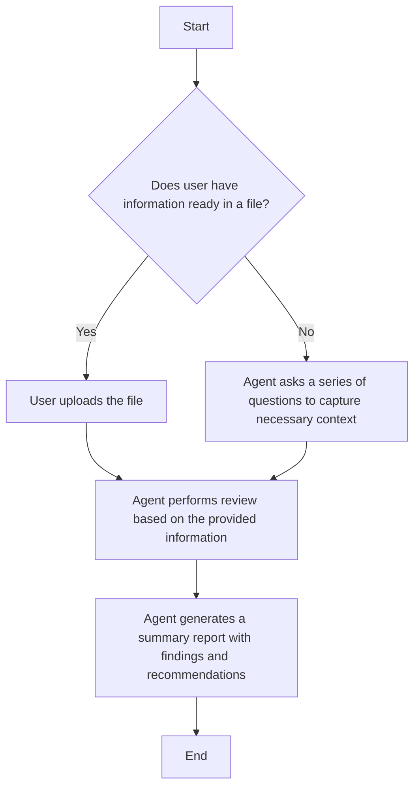

# Review Agents

Review agents are used to perform reviews only. 

## Agents

| Agent Name | Description | State |
| --- | --- | --- |
| [AI Risk Review Assistant](AI%20Risk%20Review%20Assistant.agent.md) | An agent designed to assist in the risk review of AI systems. A self-assessment agent to shift-left on identifying potential security gaps and considerations. | In testing |
| [Cybersecurity Risk Review Assistant](Cybersecurity%20Risk%20Review%20Assistant.agent.md) | An agent designed to assist in the cybersecurity risk review of systems. A self-assessment agent to shift-left on security reviews | In development |

## Tools

Tools included in review agents are selected to enable the capablity to read files within the workspace, and to generate summary reports that can be exported to a file location. Web tool is also enable to allow a broader search of relavant information to be included as part of the review.

## Intake Process

Flexibility is provided to enable user to provide inputs in text or file format. Certain minimum information is required from the user to proceed with the review. The user is given the option to perform a quick summary, or walkthrough a more detailed review.

## Governance

Prohibited actions are defined to prevent the agent from taking actions beyond what's in scope. User is also prompted to ensure sensitive information is not shared, and the agent output will not be repeating any sensitive information provided. 

## Output

The agent is provided a structured template for the output report. Notices are given to ensure user understands this is a self-assessment tool and cannot be considered as approvals from the security team.

# Workflow

# Testing

Some testing has been performed. However, more thorough testing and evaluation is needed to cover governance scenarios as well as attack scenarios.

